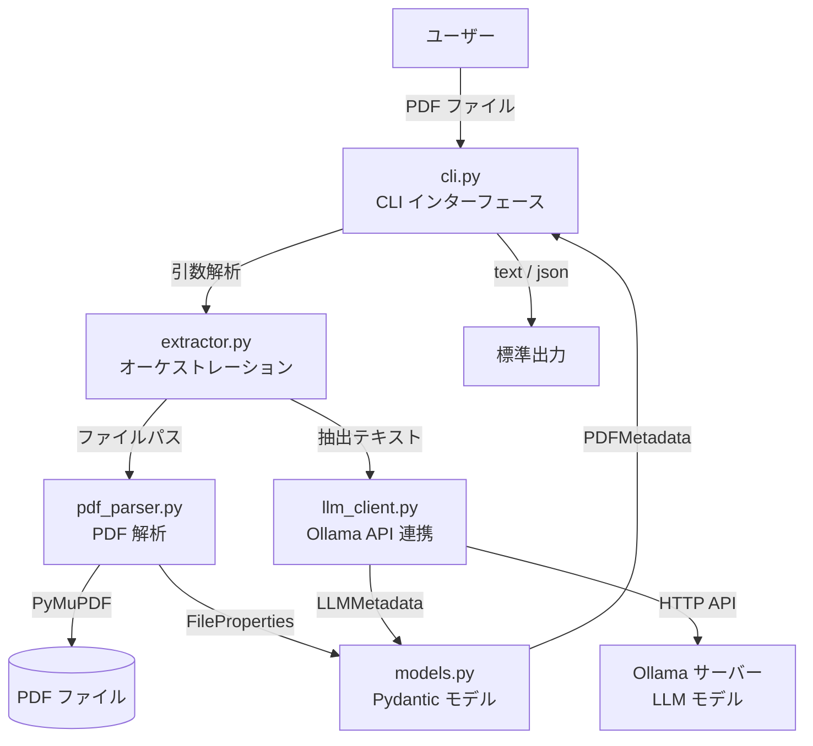
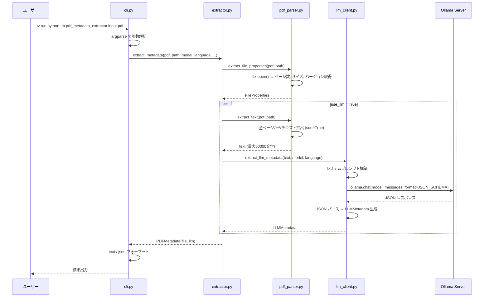
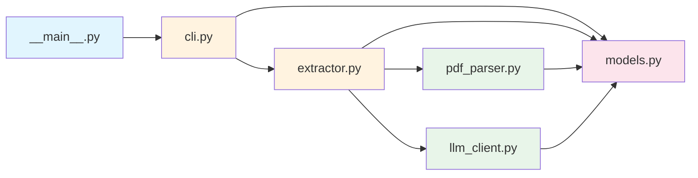
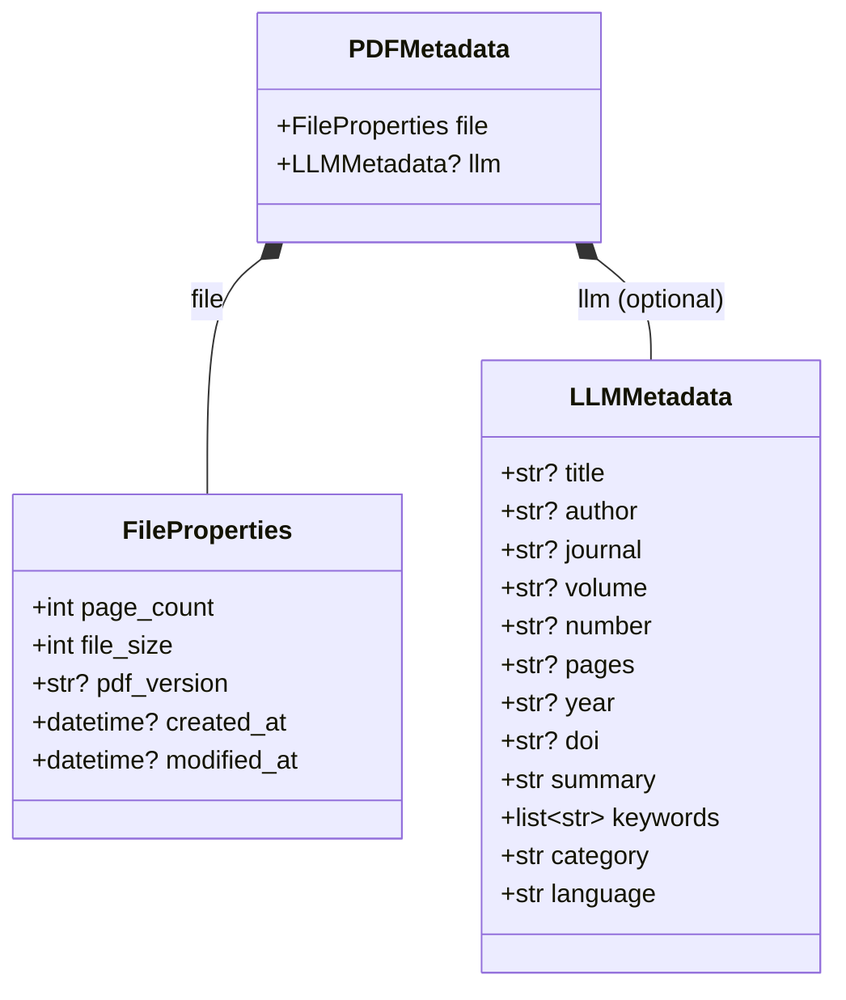
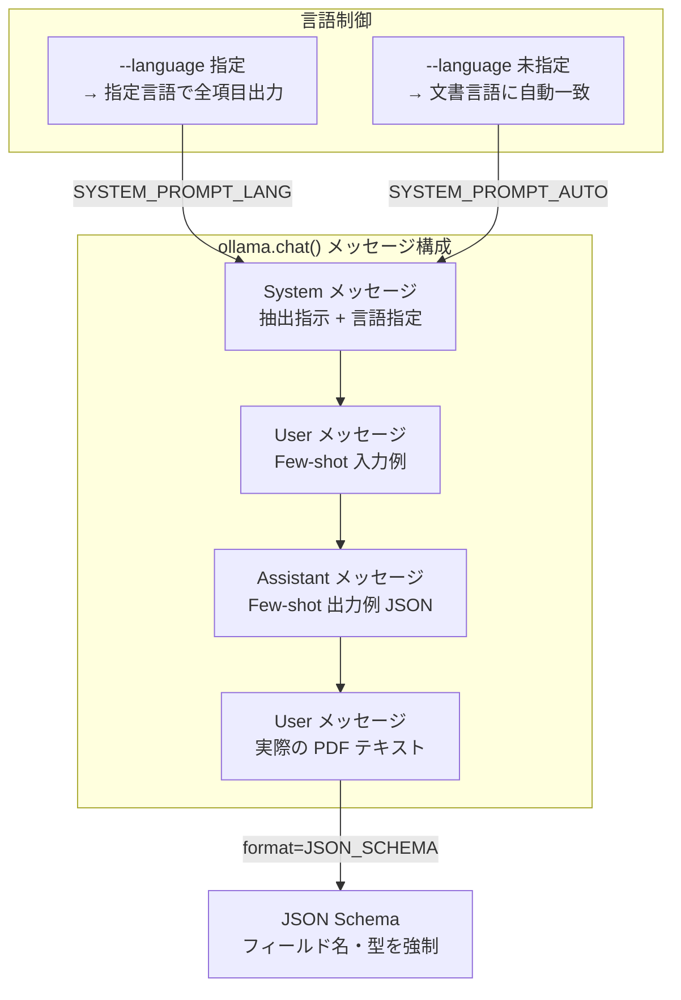
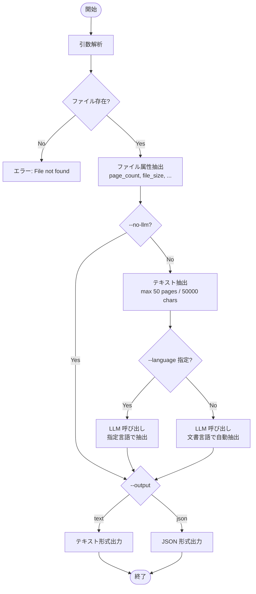
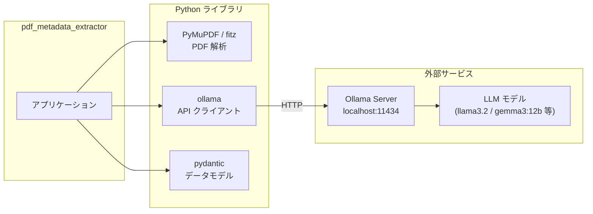

# アーキテクチャ設計書

## システム全体構成

```mermaid
graph TB
    User[ユーザー] -->|PDF ファイル| CLI[cli.py<br/>CLI インターフェース]
    CLI -->|引数解析| Extractor[extractor.py<br/>オーケストレーション]
    Extractor -->|ファイルパス| PDFParser[pdf_parser.py<br/>PDF 解析]
    Extractor -->|抽出テキスト| LLMClient[llm_client.py<br/>Ollama API 連携]
    PDFParser -->|PyMuPDF| PDF[(PDF ファイル)]
    LLMClient -->|HTTP API| Ollama[Ollama サーバー<br/>LLM モデル]
    PDFParser -->|FileProperties| Models[models.py<br/>Pydantic モデル]
    LLMClient -->|LLMMetadata| Models
    Models -->|PDFMetadata| CLI
    CLI -->|text / json| Output[標準出力]
```

## データフロー

```mermaid
sequenceDiagram
    participant User as ユーザー
    participant CLI as cli.py
    participant Ext as extractor.py
    participant PDF as pdf_parser.py
    participant LLM as llm_client.py
    participant Ollama as Ollama Server

    User->>CLI: uv run python -m pdf_metadata_extractor input.pdf
    CLI->>CLI: argparse で引数解析
    CLI->>Ext: extract_metadata(pdf_path, model, language, ...)

    Ext->>PDF: extract_file_properties(pdf_path)
    PDF->>PDF: fitz.open() → ページ数, サイズ, バージョン取得
    PDF-->>Ext: FileProperties

    alt use_llm = True
        Ext->>PDF: extract_text(pdf_path)
        PDF->>PDF: 全ページからテキスト抽出 (sort=True)
        PDF-->>Ext: text (最大50000文字)

        Ext->>LLM: extract_llm_metadata(text, model, language)
        LLM->>LLM: システムプロンプト構築
        LLM->>Ollama: ollama.chat(model, messages, format=JSON_SCHEMA)
        Ollama-->>LLM: JSON レスポンス
        LLM->>LLM: JSON パース → LLMMetadata 生成
        LLM-->>Ext: LLMMetadata
    end

    Ext-->>CLI: PDFMetadata(file, llm)
    CLI->>CLI: text / json フォーマット
    CLI-->>User: 結果出力
```

## モジュール依存関係

```mermaid
graph LR
    main["__main__.py"] --> cli["cli.py"]
    cli --> extractor["extractor.py"]
    cli --> models["models.py"]
    extractor --> pdf_parser["pdf_parser.py"]
    extractor --> llm_client["llm_client.py"]
    extractor --> models
    pdf_parser --> models
    llm_client --> models

    style main fill:#e1f5fe
    style cli fill:#fff3e0
    style extractor fill:#fff3e0
    style pdf_parser fill:#e8f5e9
    style llm_client fill:#e8f5e9
    style models fill:#fce4ec
```

## データモデル構造

```mermaid
classDiagram
    class PDFMetadata {
        +FileProperties file
        +LLMMetadata? llm
    }

    class FileProperties {
        +int page_count
        +int file_size
        +str? pdf_version
        +datetime? created_at
        +datetime? modified_at
    }

    class LLMMetadata {
        +str? title
        +str? author
        +str? journal
        +str? volume
        +str? number
        +str? pages
        +str? year
        +str? doi
        +str summary
        +list~str~ keywords
        +str category
        +str language
    }

    PDFMetadata *-- FileProperties : file
    PDFMetadata *-- LLMMetadata : llm (optional)
```

## LLM プロンプト構成

```mermaid
graph TD
    subgraph "ollama.chat() メッセージ構成"
        S[System メッセージ<br/>抽出指示 + 言語指定]
        F1[User メッセージ<br/>Few-shot 入力例]
        F2[Assistant メッセージ<br/>Few-shot 出力例 JSON]
        U[User メッセージ<br/>実際の PDF テキスト]
    end

    S --> F1 --> F2 --> U

    subgraph "言語制御"
        Auto["--language 未指定<br/>→ 文書言語に自動一致"]
        Lang["--language 指定<br/>→ 指定言語で全項目出力"]
    end

    Lang -->|SYSTEM_PROMPT_LANG| S
    Auto -->|SYSTEM_PROMPT_AUTO| S

    U -->|format=JSON_SCHEMA| Schema[JSON Schema<br/>フィールド名・型を強制]
```

## CLI オプションと処理フロー

```mermaid
flowchart TD
    Start([開始]) --> Parse[引数解析]
    Parse --> FileCheck{ファイル存在?}
    FileCheck -->|No| Error1[エラー: File not found]
    FileCheck -->|Yes| ExtractFile[ファイル属性抽出<br/>page_count, file_size, ...]

    ExtractFile --> LLMCheck{--no-llm?}
    LLMCheck -->|Yes| Format
    LLMCheck -->|No| ExtractText[テキスト抽出<br/>max 50 pages / 50000 chars]
    ExtractText --> LangCheck{--language 指定?}
    LangCheck -->|Yes| LLMCall["LLM 呼び出し<br/>指定言語で抽出"]
    LangCheck -->|No| LLMCallAuto["LLM 呼び出し<br/>文書言語で自動抽出"]
    LLMCall --> Format
    LLMCallAuto --> Format

    Format{--output}
    Format -->|text| TextOut[テキスト形式出力]
    Format -->|json| JSONOut[JSON 形式出力]
    TextOut --> End([終了])
    JSONOut --> End
```

## 外部依存関係

```mermaid
graph LR
    subgraph "pdf_metadata_extractor"
        App[アプリケーション]
    end

    subgraph "Python ライブラリ"
        PyMuPDF[PyMuPDF / fitz<br/>PDF 解析]
        OllamaLib[ollama<br/>API クライアント]
        Pydantic[pydantic<br/>データモデル]
    end

    subgraph "外部サービス"
        OllamaServer[Ollama Server<br/>localhost:11434]
        LLMModel["LLM モデル<br/>(llama3.2 / gemma3:12b 等)"]
    end

    App --> PyMuPDF
    App --> OllamaLib
    App --> Pydantic
    OllamaLib -->|HTTP| OllamaServer
    OllamaServer --> LLMModel
```
